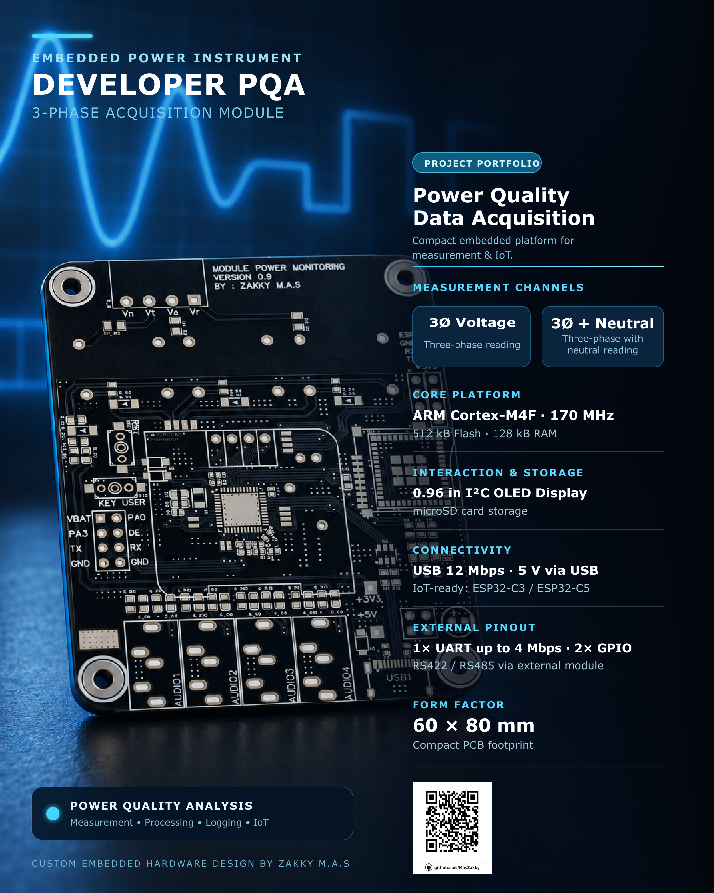
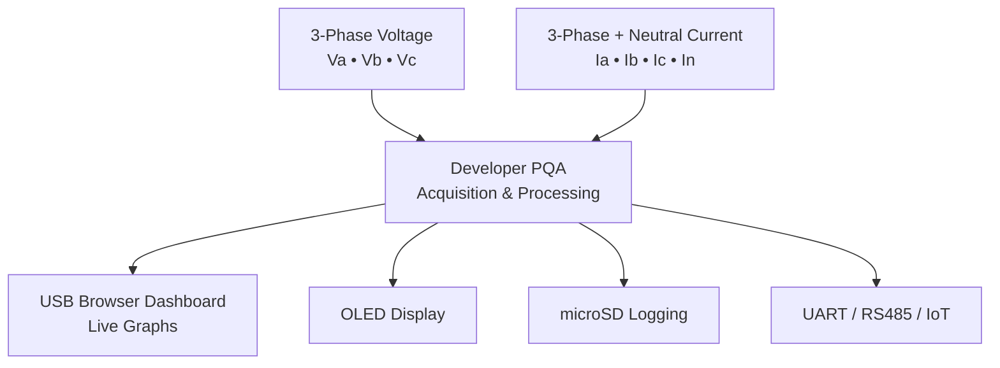

# Developer PQA

### Three-Phase Power Quality Acquisition Module

**Measure • Process • Visualize**

 

## Overview

**Developer PQA** is a compact embedded platform for developing three-phase electrical measurement and power-quality monitoring systems. The module acquires **three-phase voltage**, **three-phase current**, and **neutral current** data in real time.

Powered by an **ARM Cortex-M4F running at 170 MHz**, Developer PQA combines high-speed acquisition, local display, removable storage, USB communication, serial connectivity, and IoT expansion in a compact **60 × 80 mm** board.

A key capability of the platform is **USB-based web visualization**. Measurement data can be sent to a computer through USB and displayed as live graphs in a browser-based dashboard. This enables engineers to observe voltage, current, waveform behavior, and load changes without requiring a dedicated industrial display.

Developer PQA is intended for power-quality research, energy-monitoring prototypes, educational laboratories, electrical test benches, and custom embedded instrumentation.

## Key Features

* Real-time measurement of **three-phase voltage**
* Real-time measurement of **three-phase current**
* Additional **neutral-current** measurement channel
* ARM Cortex-M4F processing at **170 MHz**
* Browser-based live monitoring through **USB**
* Local information display using a **0.96-inch I²C OLED**
* Data logging support through **microSD card**
* UART communication up to **4 Mbps**
* RS422 / RS485 support through an external transceiver module
* Two configurable GPIO pins
* Optional Wi-Fi / IoT expansion using **ESP32-C3 or ESP32-C5**
* Compact board size for laboratory, prototype, and field development

## System Concept

## USB Web Monitoring

Developer PQA can stream measurement data through its **12 Mbps USB connection** to a computer. A web-based dashboard can then present the data as live charts, making electrical behavior easier to observe during testing and development.

Possible dashboard functions include:

* Real-time voltage and current graphs
* Multi-channel waveform visualization
* Device status monitoring
* Measurement-data logging
* Power, harmonic, and power-quality analysis features as the firmware develops

## Hardware Specifications

| Category                  | Specification                                                   |
| ------------------------- | --------------------------------------------------------------- |
| Measurement inputs        | 3-phase voltage, 3-phase current, and 1 neutral-current channel |
| Main processor            | ARM Cortex-M4F                                                  |
| CPU frequency             | 170 MHz                                                         |
| Flash memory              | 512 kB                                                          |
| RAM                       | 128 kB                                                          |
| Local display             | 0.96-inch I²C OLED display                                      |
| Storage                   | microSD card                                                    |
| USB communication         | USB Full-Speed, up to 12 Mbps                                   |
| UART                      | 1 × UART, up to 4 Mbps                                          |
| Industrial serial support | RS422 / RS485 via external module                               |
| GPIO                      | 2 × GPIO                                                        |
| IoT expansion             | ESP32-C3 / ESP32-C5 support                                     |
| Operating voltage         | 5 V via USB                                                     |
| PCB dimensions            | 60 × 80 mm                                                      |

## Portfolio Gallery

### Hardware Portfolio

### Website Dashboard Portfolio

> Coming soon — screenshots and demonstrations of the USB-based web monitoring dashboard will be added here.

<!-- Future image path:

-->

### Firmware and Coding Portfolio

> Coming soon — firmware architecture, embedded software, communication protocol, and signal-processing implementation will be added here.

<!-- Future image path:

-->

## Project Status

This project is under active development. The hardware platform is available as a prototype, while firmware, USB dashboard features, data logging, and advanced power-quality analysis are being continuously developed.

## Applications

* Three-phase energy-monitoring systems
* Power-quality analysis prototypes
* Electrical laboratory instruments
* Industrial monitoring demonstrations
* Embedded-system research
* Educational projects in power electronics and electrical engineering
* Custom data-acquisition systems

## Maintainer

Developed and maintained by [MasZakky](https://github.com/MasZakky).

---

**Developer PQA — Turning electrical measurements into meaningful visual information.**

